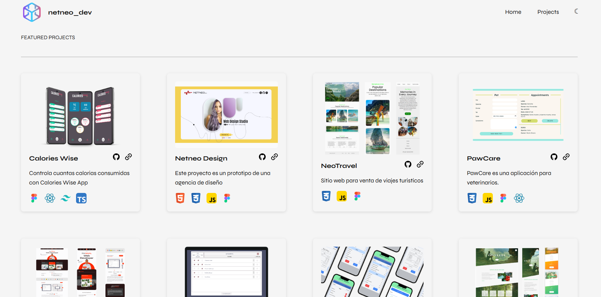
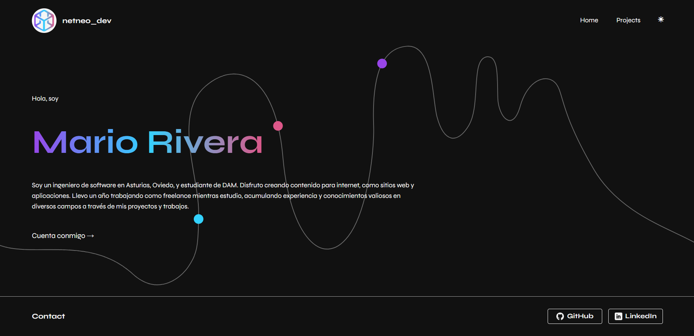

# 🌟 Portfolio Personal con Vite

Este proyecto es un **portafolio web de dos páginas**, desarrollado utilizando **Vite** como herramienta de construcción rápida y moderna. El enfoque principal ha sido la creación de **componentes reutilizables** generados dinámicamente.

El portafolio incluye:
- **Modo oscuro y claro** 🌓
- **SVG animados** para un diseño atractivo.
- Presentación de mis **proyectos más importantes**.

---

## 🌈 Características principales

1. **Componentes reutilizables**: Diseñados para maximizar la eficiencia y escalabilidad del código.
2. **Generación dinámica**: Los componentes se crean utilizando los datos almacenados en un objeto en JavaScript.
3. **Modo oscuro/claro**: Permite a los usuarios alternar entre temas.
4. **SVG animados**: Aportan dinamismo al diseño visual del portafolio.
5. **Páginas**:
   - **Página principal**: Presenta un resumen de quién soy y qué hago.
   - **Proyectos destacados**: Muestra los trabajos más relevantes.

---

## 🖼️ Capturas de pantalla

<!-- 
 -->

  
  

---

## 🔗 Versión Online

Puedes acceder a sitio web en el siguiente enlace:
[Neoneo_dev Portfolio Vite](https://portfoliovite-netneo.netlify.app/)

