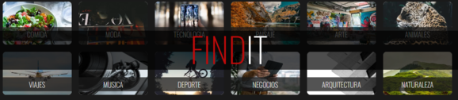
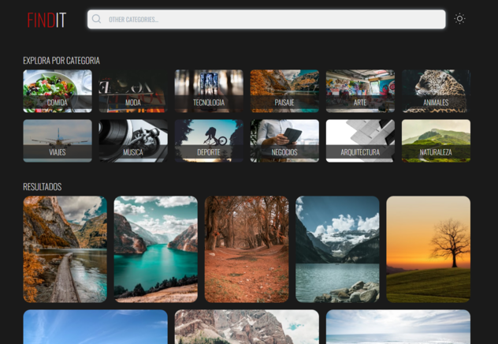
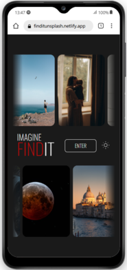

# 📸 Find It

 

**Find It** is a web application created as part of a challenge for my Fullstack
Master program. The goal was to implement API requests, specifically to the
**Unsplash API**, and emulate functionalities similar to Pinterest. Built with
**Vite**, the project uses reusable components, designed and structured with
**Vanilla JavaScript**, to ensure scalability and maintainability.

---

## 🚀 Key Features

### 🌟 **Dynamic Content Loading**

- Fetches images from Unsplash API with a limit of **50 requests/hour**.
- Implements infinite scrolling with a cap of 30 images per request.
- Uses the **Intersection Observer API** for smooth animations when loading
  images dynamically.

### 💾 **Optimized Data Management**

- Images from each API request are stored in **Local Storage**.
- Stored data expires every hour to free up space and maintain responsiveness.
- Prevents excessive API calls while ensuring a seamless user experience.

### 🎨 **Responsive & Original Design**

- Designed entirely in **Figma** with attention to detail.
- Fully **responsive** layout, with dynamic containers for better adaptability
  to different screen sizes.

### 🌌 **Light & Dark Modes**

- Persistent **dark and light mode** across pages, with preferences stored in
  **Local Storage**.

### 🔍 **Advanced Search Functionality**

- Search through **12 predefined categories** or any keyword entered by the
  user.
- Displays results with smooth animations triggered by the **Observer API**.

### 🔄 **Interactive Home Page**

- The home page dynamically loads **two groups of images** every hour.
- Images are shuffled on every page reload for a fresh experience.
- Includes an **infinite slider** with no lags or pauses:
  - **Hover effect** highlights the selected image and momentarily pauses the
    animation.

---

## 🛠️ Challenges & Learnings

1. **API Request Limitations**

   - The Unsplash API restricts requests to 50/hour, requiring creative
     solutions to avoid a blank screen for users.
   - Placeholder functionality for unavailable features, such as a "Download
     Photo" button that currently logs a greeting in the console.

2. **Dynamic Image Management**

   - Storing images in Local Storage helped balance API usage and ensure a
     smooth experience.
   - Implementing animations for independent containers with dynamic content was
     particularly challenging.

3. **Smooth Infinite Slider**

   - Achieved a lag-free experience by carefully managing animation timing and
     hover interactions.

4. **Responsive Design**
   - Adapting dynamic containers for various screen sizes required innovative
     layout solutions.

---

## 📸 **Preview**

  
  

---

## 🌐 **Live Demo**

🔗 [Visit the live project here](#)

---

## 📬 Contact

  

