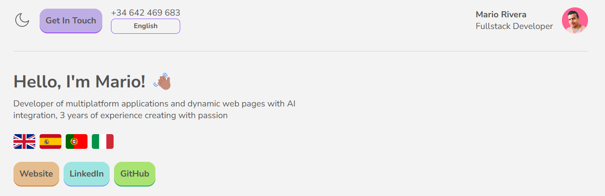

# 🌐 Dynamic DOM Builder with Multi-Language Support & Dark Mode

  

This project showcases a dynamic approach to building web page elements directly
from JavaScript objects, eliminating the need for initial HTML content.
Developed with TypeScript for enhanced type safety and code maintainability, it
demonstrates modularity, responsiveness, and advanced features like
multi-language support and a user-preferred dark mode.

## ✨ Key Features

- **Dynamic DOM Generation:** All DOM elements are created on the fly based on
  key-value pair objects, ensuring a clean and organized codebase.
- **Modular Architecture:** The project is structured into distinct layout
  modules, each residing in its own directory. Each module includes:
  - A dedicated function for creating the section's HTML structure.
  - A translation function to handle multi-language content.
  - Its own CSS file for isolated styling.
  - A data file (JavaScript object) defining the HTML elements.
- **TypeScript Power:** Leveraging TypeScript to enforce static typing,
  resulting in more robust and easier-to-maintain code. This was a personal
  challenge beyond the master's requirements.
- **Multi-Language Support (EN, ES, IT, PT):** Implemented support for four
  languages, with translations loaded asynchronously from JSON files using
  `async/await`. This was an additional feature beyond the master's
  requirements.
- **Comprehensive JSDoc Comments:** The primary functions, `buildHTMLElements`
  and `generateElements`, are thoroughly documented using JSDoc for improved
  code understanding.
- **Dark Mode with Local Storage:** A dark mode feature allows users to switch
  themes, with their preference persistently stored in the browser's local
  storage.
- **Initial Language Detection:** The application detects the user's preferred
  language on initial load using `navigator.language` and stores it in local
  storage for subsequent visits. Language changes are also saved to local
  storage.
- **Organized TypeScript Types:** Custom types are neatly organized into
  separate files for better project structure and readability.
- **Responsive Design:** The layout adapts seamlessly to different screen sizes.
- **Built with Vite:** Utilizing Vite for a fast and efficient development
  experience.
- **Figma Design:** The visual design is based on a free font sourced from
  Figma.

## 🛠️ Technologies Used

- **TypeScript:** Superset of JavaScript that adds static typing.
- **Vite:** Next-generation frontend tooling for fast development.
- **CSS:** Styling language for the web.

## ✍️ Author

This project was developed as part of a Full Stack Development Master's program
by netneo.es

---

