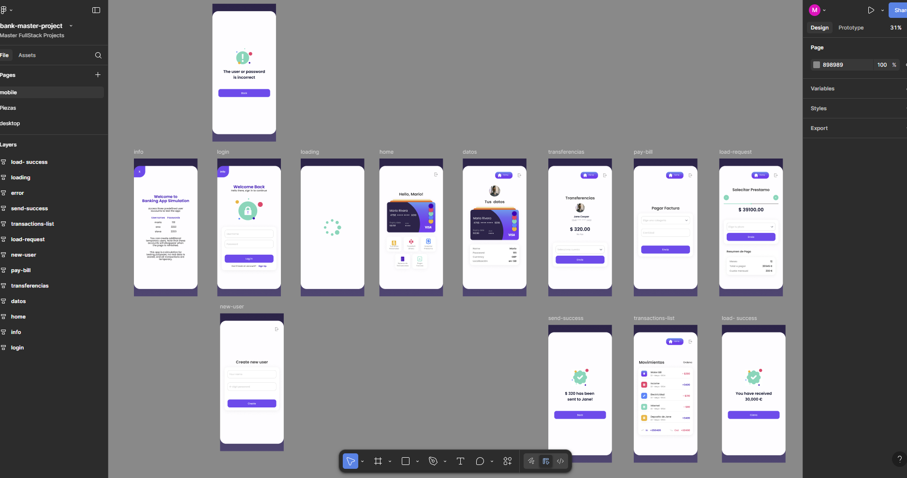
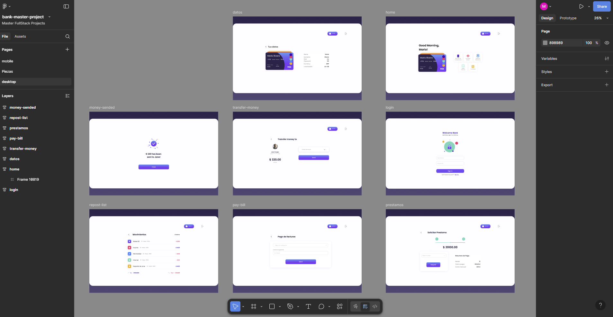

# 💳 Simulated Banking Application | Bankneo

This project is a simulation of a digital banking application, developed as a
practice exercise to apply frontend development knowledge, validations, business
logic, and professional structure.

The application allows users to simulate common banking operations such as
login, registration, transfers, loans, and bill payments, all in a safe
environment without real storage or backend connection.

> ⚠️ This system is **for educational and practice purposes only**. All data is
> temporary and will not persist after a reload.

---

## 🧩 Project Goals

- Simulate the real flow of a banking application from the user's point of view.
- Design a scalable modular structure using development best practices.
- Apply validations, state management, and internal logic without relying on a
  backend.
- Document the functional and technical flow as in a real professional
  environment.

---

## ✨ Key Features

- Login with simulated users
- Registration of new test users
- Bank card view with hidden data
- Money transfers between accounts (with currency conversion if needed)
- Loan requests with automatic interest calculation
- Sortable transaction history
- Bill payments with balance validation
- Logout from any screen
- Simulated data loading (using `setTimeout`)
- Modularity and separation of logic and presentation

---

## ⚙️ Technologies Used

  
  
  
    
  
  
  

| Tool                  | Description                                  |
| --------------------- | -------------------------------------------- |
| **Vite**              | Modern frontend development framework        |
| **TypeScript**        | Static typing for improved robustness        |
| **CSS**               | Component-based scoped styling               |
| **Frankfurter API**   | Currency conversion between users            |
| **locale-currency**   | Automatic currency/location detection        |
| **pravatar.cc**       | User profile placeholder image generator     |
| **Utility functions** | For calculations, masks, and data generation |

---

## 📚 Project Documentation

Detailed documentation is located in the `/docs` folder. It includes the three
fundamental pillars to understand the project from different perspectives:

- 📌 [**Requirements Analysis**](./docs/requirements.md)  
  What the app must do, its goals, users, constraints, and expected features.

- 🔍 [**Event Flow Analysis**](./docs/event-flow.md)  
  Step-by-step narration of app behavior from the user/tester perspective.

- 🧠 [**Internal Technical Documentation**](./docs/internal-flow.md)  
  Details about internal functions, calls, business logic, validations, and API
  usage.

---

## 🎨 Figma Design Preview

Here’s a visual preview of the interface design made in Figma before
development:

  
  

---

## 🚀 See It Live

Simulate the experience directly in your browser.

---

## 🌐 More About Me

Discover more of my projects and services

Let’s build something amazing

